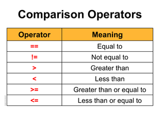

# Fun Language Design

**End of line** → represented by  ':)' symbol.

**Statement blocks** → starts with '{:' symbol and ends with ':}' symbol.

**Reserved words** → must be uppercase.

---

## Variables

**Variable Types** → `INT` `CHAR` `STR` `BOOL`. Arrays are also available.

### **Rules for Variable Names**

Regular expression:  [a-z_]+ → lowercase letters and _. 

- It must consist of letters or underscores.
- Letters must be lowercase.
- It can not contain any other symbol like digits.

### **Declaration**

```
variable_name ⇒ INT :)
array_name ⇒ INT[array_size] :)
```

### **Initialization**

```
variable_name = 5 :)
array_name[index] = 10 :)
```

---

## Condition statement

### Rules

- `ELIF` and `ELSE` parts are optional.
- Statements to execute when the condition is met must be written inside a block.

```
IF (*CONDITION*){: *STATEMENT* :}
ELIF (*ANOTHER_CONDITION*){: *STATEMENT* :}
ELSE {: *STATEMENT* :}
```

```
IF (*CONDITION*) {: 
	*STATEMENT* 
:}
ELIF (*ANOTHER_CONDITION*) {: 
	*STATEMENT* 
:}
ELSE{: 
	*STATEMENT* 
:}
```

### **Comparison Operators**



```jsx
// example comparison statements. 
variable_x < variable_y
variable_x < 5
5 < variable_x
```

## Loop statement

### Rules

- Statements to execute when the condition is met must be written inside a block.

```
WHILE (*CONDITION*) {:
	*STATEMENT*
:}
```

## Function definition

### Rules

- Function statements must start with `FUN` keyword.

```
FUN function_name (*TYPE* parameter_name_one, ..., *TYPE* parameter_name_n) => *RETURN_TYPE* {:
	*STATEMENT*
	RETURN return_variable :)f
:}
```

call the defined function by :

```
function_name(parameter_name_one, ..., parameter_name_n) :)
```

## Built-in functions

EXIT( ) → to exit the program

PRINT( value ) → to print a value (except for arrays, you should print each element of array separately)